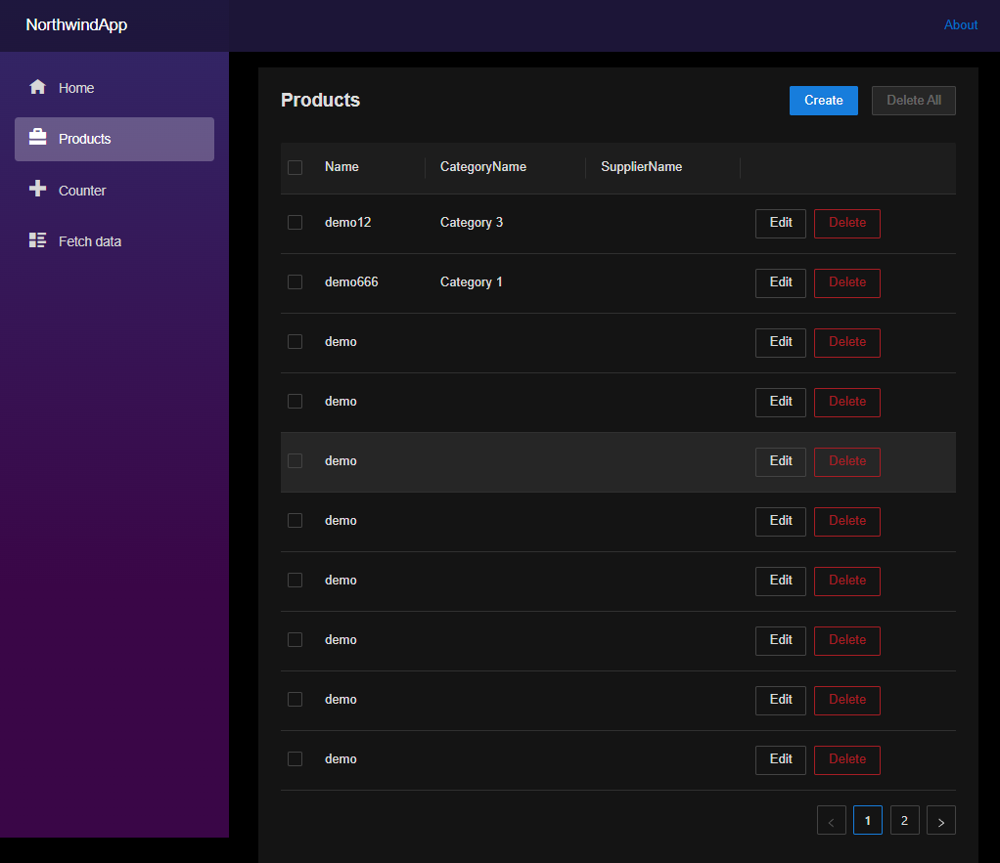

# northwind-dotnet projects

Implementing the specification of northwind application at https://github.com/thangchung/northwind-specs

# Setup Environment Variables

Create `.env` file with content as below

```bash
POSTGRES_USER=northwind
POSTGRES_PASSWORD=<your password>
POSTGRES_DB=northwind_db

ConnectionStrings__northwind_db=Server=localhost;Port=5432;Database=northwind_db;User Id=northwind;Password=<your password>;
Kafka__BootstrapServers=localhost:9092
Kafka__SchemaRegistryUrl=http://localhost:8081
AuditorGrpcUrl=https://localhost:5006
```

And now you are ready to start it

```bash
> tye run --watch
> dotnet watch run // for Blazor Web
```

# Screen shots



# HTTP/3 with gRPC
- https://github.com/grpc/grpc-dotnet/issues/1478
- https://devblogs.microsoft.com/dotnet/http-3-support-in-dotnet-6/
- https://devblogs.microsoft.com/dotnet/net-5-new-networking-improvements/
- https://docs.microsoft.com/en-us/dotnet/core/extensions/httpclient-http3#using-httpclient

# Reference stuffs
- https://minimal-apis.github.io/